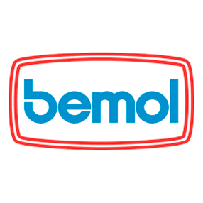
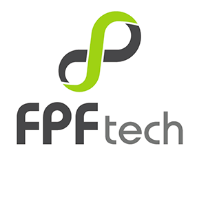

## Olá! Eu sou o Raimundo Pires de Simas Júnior, mas conhecido como Júnior Simas,

Sou Técnico em Informática há 14 anos e atuo como suporte de hardware, sistemas operacionais, aplicativos de escritório, rede e Internet, CFTV e servidores.

Busco constantemente, aprendizado e desafios. Estou sempre empenhado em aprimorar meus conhecimentos. Por isso, este ano, decidi fazer um upgrade na minha carreira, migrando da Infraestrutura de TI tradicional para Desenvolvimento Web. Desafiei-me a atuar com a transformação digital, que me motiva a seguir em frente, agregando valor à equipe, por meio da minha experiência em Suporte Técnico.

Possuo ótimo senso de comprometimento e responsabilidade, de forma a entregar resultados da melhor forma possível, considerando prazos e prioridades. Gosto de trabalhar em equipe, pois entendo que o compartilhamento de experiências, agrega tanto no âmbito pessoal, quanto no resultado de um projeto.

<div align="right">
<br>


</div>

<div align="center">

[+ao+meu+perfil;Sou+Desenvolvedor+Backend+Jr%F0%9F%91%A8%F0%9F%8F%BE%E2%80%8D%F0%9F%92%BB;Em+busca+de+uma+oportunidade%F0%9F%91%A8%F0%9F%8F%BE%E2%80%8D%F0%9F%92%BC;Bacharel+em+Ci%C3%AAncia+da+Computa%C3%A7%C3%A3o%F0%9F%91%A8%F0%9F%8F%BE%E2%80%8D%F0%9F%8E%93;T%C3%A9cnico+em+Inform%C3%A1tica%F0%9F%91%A8%F0%9F%8F%BE%E2%80%8D%F0%9F%94%A7)](https://git.io/typing-svg)
</div>

# 👨🏾‍💻  Perfil

<br>

<div style="width:100%; position:relative;">
  
</div>

```js
const desenvolvedor = {
    nome: 'Raimundo Pires de Simas Júnior',
    area: 'Backend',
    profissao:'Suporte Técnico em TI',
    idade: 38
}
const endereco = {
    cidade: 'Manaus',
    estado: 'AM'
}

const dados = {
    ...desenvolvedor,
    ...endereco,
    disponivel_mercado: True
}
console.log(dados);
```

<br>

- 👨🏾‍💻 Sou Desenvolvedor Backend Jr;
- 👨🏾‍💼 Em busca de uma oportunidade;
- 👨🏾‍🎓 Bacharel em Ciência da Computação;
- 👨🏾‍🔧 Técnico em Informática;
- 👨🏾‍🏫 Estudando para me tornar Desenvolvedor Full Stack (Frontend e Backend);
- 👨🏾‍🚀 Apaixonado por Tecnologia, Desenvolvimento, Aprendizado Contínuo e Criatividade;
- 🫱🏾‍🫲🏿 Disponível para o mercado de trabalho;
- ❤️ Quando não estou programando, você pode me encontrar estudando, lendo, e passando um tempo em família.
- 🤔 Quer me conhecer melhor? <a href="https://api.whatsapp.com/send/?phone=5592991068482&text=Ol%C3%A1%2C+vim+do+seu+Github+e+gostaria+de+contrata-lo&type=phone_number&app_absent=0">clique aqui</a>

<br>

# ⌨️ Linguagens

<br>


# 📚 Bibliotecas & Framework

<br>


# 🛠️ Ferramentas & Plataformas

<br>


  
<br>

# 🔝 Linguagens mais usadas

<br>

<p align="center">
 
</p>
  
<br>

# 👨🏾‍💼 Experiência de trabalho

<br/>

[](https://www.facebook.com/Polynorte/)

[**Técnico de Apoio ao Usuário de Informática**](https://www.linkedin.com/in/juniorsimas26) \
Polynorte Embalagens\
nov de 2017 - ago de 2023 · 5 anos e 9 meses\
  Serviços: `chamados externos`, `visitas técnicas`, `reduções de custos operacionais`, `sistema de CFTV`
 
 <br/>

[](https://www.apamoveis.com.br/)

[**Web Designer**](https://www.linkedin.com/in/juniorsimas26) \
Apa Móveis\
mai de 2021 - set de 2017 · 8 meses\
  Serviços: `Cadastro de produtos`, `Edição de imagens`, `Descrição de produtos`, `Redes Sociais`, `Atendimento ao cliente`

<br/>

[](https://seringasr.com.br/)

[**Assistente de Informática Pleno**](https://www.linkedin.com/in/juniorsimas26) \
SR Saldanha Rodrigues LTDA\
dez de 2014 - fev de 2016  · 1 ano e 2 meses\
  Serviços: `Monitoramento de processos INJET`, `Map Cardoso`, `CLP`, `Rotina de Backup`, `Servidor AD`, `Servidor DHCP`, `Suporte Técnico a Usuário`
  
<br/>

[](https://www.bemol.com.br/)

[**Técnico de Suporte Júnior**](https://www.linkedin.com/in/juniorsimas26) \
Benchimol Irmão & Cia Ltda - Bemol\
out de 2006 - fev de 2011  · 4 anos e 10 meses\
  Serviços: `manutenção em equipamentos de informática`, `visitas técnicas em lojas`,`implantação NComputing`, `Suporte Técnico a Usuário`
  
<br/>

# 👨🏾‍🎓 Formação acadêmica

<br>


**Ciênicia da Computação**\
UNINORTE - Centro Universitário do Norte\
Jan de 2015 - Dez de 2019 · 4 anos

<br>



**Programador Web Nível Básico**\
FPF TECH - Fundação Desembargador Paulo Feitoza\
Mar de 2004 - Out de 2004 · 7 meses

<br>

# ✉️ Contatos

<br>

Conecte-se comigo em outras redes! Se precisar de ajuda ou tiver dúvidas e sugestões, me mande uma mensagem 😉

[](mailto:juniorsimas26@gmail.com)

[](https://www.linkedin.com/in/juniorsimas26)

[](https://github.com/juniorsimas)

[](https://www.facebook.com/juniorsimas26)

[](https://www.instagram.com/juniorsimas26)
  
<br><br>

# 📊 Estatísticas no GitHub

<br>

<p align="center">
   

   
</p>
  
<br>
  
<br>

<br>

<br>

[](https://github.com/juniorsimas/juniorsimas/blob/main/README.md)

<br>
 
 <div>
  
</div>
